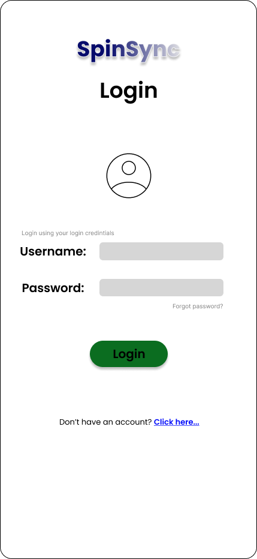

# SpinSync – Mobile App UI/UX Case Study

## Project Overview
SpinSync is a mobile application UI concept designed for a laundry service platform.  
The goal of this project is to create a simple, clean, and user-friendly experience for booking laundry services and tracking orders.

## Design Approach
I designed the SpinSync mobile UI by self-learning UI/UX design through open-source resources, driven by my interest in product design.

## Tools Used
- Figma

## UI Screenshots

### Landing Screen

### Home Screen

### Login Screen

### Refer and Earn Screen

### Premium Screen

## 🔗 Figma Design Link
https://www.figma.com/design/Dxfe0tZUuCCceqdDWZdMP1/Mobile-App--Laundry-service

## Note
This is a self-initiated learning project created for portfolio purposes.
